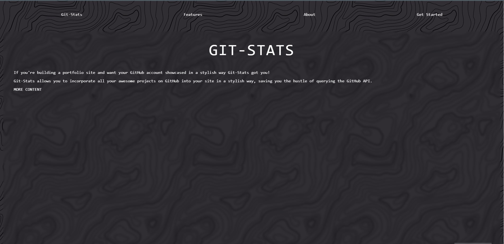

 

  
  <h3 align="center">Git Stats</h3>
  

    A convienient tool for developers to showcase github projects
     
    <a href="https://github.com/philimon-reset/Git-Stats"><strong>Explore the docs»</strong></a>
  

<!-- TABLE OF CONTENTS -->

  
Table of Contents

  <ol>
    <li>
      <a href="#Introduction">Introduction</a>
      <ul>
        <li><a href="#built-with">Built With</a></li>
      </ul>
    </li>
    <li>
      <a href="#getting-started">Getting Started</a>
      <ul>
        <li><a href="#installation">Installation</a></li>
      </ul>
    </li>
    <li><a href="#usage">Usage</a></li>
    <li><a href="#roadmap">Roadmap</a></li>
    <li><a href="#license">License</a></li>
    <li><a href="#contact">Contact</a></li>
  </ol>

<!-- Introduction -->
## Introduction

We have all been their, wanting to showcase our best projects to get that dream gig, but building websites for all those projects might not seem like a great idea.

Here's why:
* Your time should be focused on creating something amazing. A project that solves a problem and helps others
* You shouldn't be doing the same tasks over and over like creating boiler plate site for smaller projects

So, what are you supposed to do?

Here comes git stats to the rescue. Working with you portfolio website, be able to insert amazing looking card lists showcasing your github repositories

!! THE SITE ISNT RUNNING YET AND IS BEING USED WITH NGROC AND [OUR LOCAL HOST](http://localhost:5000.com)

### Built With

* [tailwind](https://tailwindcss.com)
* [JQuery](https://jquery.com)
* [Flask](https://flask.palletsprojects.com/)
* [Python](https://python.org)
* [Vue.js](https://vuejs.org/)
* [Ngrok](https://dashboard.ngrok.com/)

<!-- GETTING STARTED -->
## Getting Started

This is an example of how you may integrate this tool for your requirments.

### Installation

1. Go to the site 
2. Input your GitHub login information.
3. Copy the given html block to your Portfolio page.
4. Enjoy

<!-- USAGE EXAMPLES -->
## Usage

We can use this tool to make our projects precentable to future employers without needlessly building multiple site for each one.

<!-- ROADMAP -->
## Roadmap

- [x] Work on the MVP (minimum viable product) to showcase proof of concept
- [x] Implement tailwindcss to improve the static css styling
- [ ] Migrate database to mysql to allow customizable 
- [ ] Make the product portable ,like disquss, to allow to move the html block to the users website.
- [ ] Deploy the product on our main site.
- [ ] Improve customizablity by:
    - [ ] Allowing a user to save their git stats preferences
    - [ ] Adding more customizability

<!-- LICENSE -->
## License

No licenses available.

## Related projects

None found so far. The project that resembles git stats most is disquss tool.

## Contributing

Add pull requests to improve Git stats where it can be improved.

<!-- CONTACT -->
## Contact

Hizkyas Tekele:
* Github: [https://github.com/Doro-000](https://github.com/Doro-000)
* Linkedin: [(http://www.linkedin.com/in/Hizkyas-T-Aberra](http://www.linkedin.com/in/Hizkyas-T-Aberra)
 

Philimon Derib:
* Github: [https://github.com/philimon-reset](https://github.com/philimon-reset)
* Linkedin: [https://www.linkedin.com/in/philimon-derib/](https://www.linkedin.com/in/philimon-derib/)

Project Link: [https://github.com/philimon-reset/Git-Stats](https://github.com/philimon-reset/Git-Stats)
